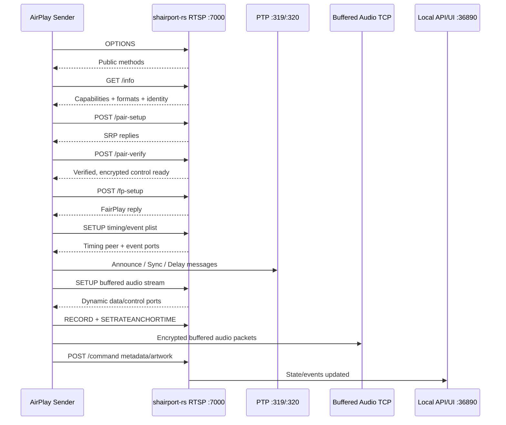
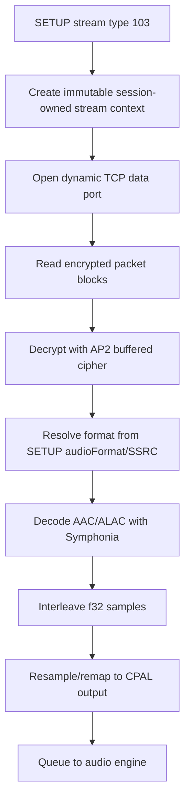
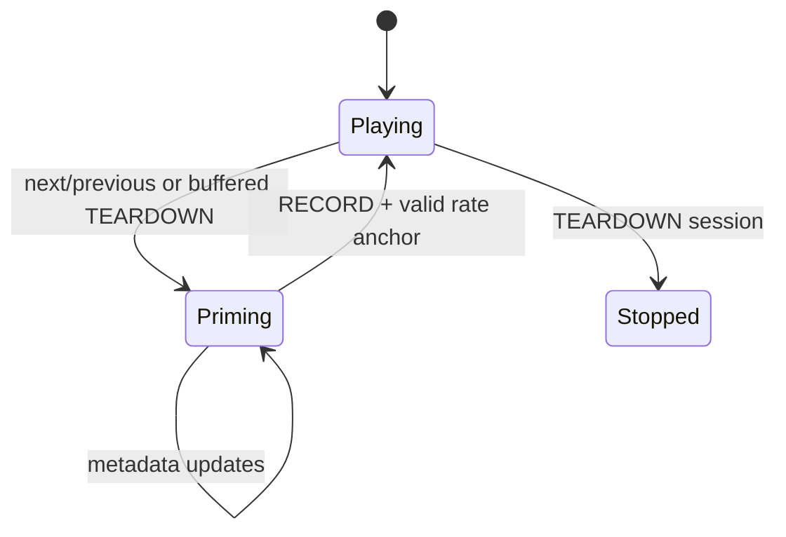

# shairport-rs

Rust-native AirPlay receiver workbench for Shairport Sync. The current focus is
AirPlay 2 audio, local media controls, CPAL output, PTP timing, and flexible
mDNS discovery.

## Run

```powershell
cargo run --manifest-path shairport-rs/Cargo.toml -- --config shairport-rs/shairport-rs.toml
```

The local API and web UI listen on `127.0.0.1:36890` by default.

## Configuration layers

Runtime configuration is resolved in this order, from highest to lowest priority:

```text
command-line option > SHAIRPORT_RS_* environment > TOML file > built-in defaults
```

Every field in `Config` is exposed as a command-line option. Section names are used as
prefixes, so `[mdns].backend` is `--mdns-backend`, `[audio].host` is `--audio-host`,
and `[system_media].enabled` is `--system-media-enabled`. Run `shairport-rs --help`
for the complete generated list.

For example, select Apple's Bonjour / DNS-SD publisher on Windows without editing the
TOML file:

```powershell
cargo run --manifest-path shairport-rs/Cargo.toml -- `
  --config shairport-rs/shairport-rs.toml `
  --mdns-backend dns-sd `
  --audio-host wasapi
```

Boolean overrides take an explicit value, for example:

```powershell
--airplay2-enabled true --system-media-enabled false
```

Environment variables use `SHAIRPORT_RS_` plus a double underscore between the TOML
section and field name:

```powershell
$env:SHAIRPORT_RS_MDNS__BACKEND = "dns-sd"
$env:SHAIRPORT_RS_AUDIO__HOST = "wasapi"
$env:SHAIRPORT_RS_SYSTEM_MEDIA__ENABLED = "false"
```

`SHAIRPORT_RS_CONFIG` still selects the config file and `SHAIRPORT_RS_DEBUG` still
controls debug logging.

## Discovery

`mdns.backend = "auto"` is the default. Auto mode uses the native mDNS publisher
when it is installed, then falls back to the built-in Rust publisher.

| Platform | Auto order |
| --- | --- |
| Linux | `avahi-publish-service`, `dns-sd`, built-in |
| macOS | `dns-sd`, `avahi-publish-service`, built-in |
| Windows | `dns-sd`, `avahi-publish-service`, built-in |
| Other | `dns-sd`, `avahi-publish-service`, built-in |

The built-in backend publishes `_raop._tcp.local.` and `_airplay._tcp.local.`
with automatic LAN address selection. On hosts with multiple adapters, set
`mdns.interface` to the interface that shares a network with the Apple sender.
On Windows, allow inbound UDP 5353 and TCP 7000 for the daemon.

```toml
[mdns]
backend = "auto"
service_name = "Shairport RS"
hostname = "shairport-rs"
```

Explicit backends are still available:

```toml
[mdns]
backend = "builtin"  # auto, builtin, dns-sd, avahi, external, off
```

For `backend = "external"`, set `external_command` to a command that accepts:

```text
<instance-name> <service-type> <port> <txt>...
```

## Audio

Audio output uses CPAL. `host = "default"` lets CPAL select the platform default
host, which is typically WASAPI on Windows, CoreAudio on macOS, and ALSA/Pulse or
the available CPAL default on Linux. The decoder emits interleaved `f32`, and
the audio engine resamples/remaps to the selected output device format.

The output stream is supervised at runtime. If the active device is unplugged
or invalidated, the receiver closes the output gate, flushes/re-primes playout,
and retries on an available device. With no explicit device configured it
follows system-default changes; an explicit device is preferred and the
receiver temporarily falls back to the system default while that device is
unavailable. The CPAL callback remains lock-free during these transitions.

```toml
[audio]
backend = "cpal"
host = "default" # default, wasapi, coreaudio, alsa, asio, jack
```

ASIO support is feature-gated:

```powershell
cargo build --manifest-path shairport-rs/Cargo.toml --features asio
```

## System media controls

System media integration is enabled by default. It publishes now-playing metadata,
playback state, artwork, and progress to Linux MPRIS, Windows System Media Transport
Controls (SMTC), and macOS Now Playing / Remote Command Center. Play, pause, toggle,
stop, next, and previous commands are routed through the same local/DACP command path
as the HTTP API. Linux MPRIS volume changes control the receiver's local output gain.
The receiver publishes `can_seek = false` and ignores seek requests because it does not
own the sender's timeline. Local play/pause/stop commands are applied through the playout
scheduler so watermark recovery cannot reopen audio after a user pause. Sender delivery
prefers DACP and falls back to a connected AirPlay 2 type-130 MediaRemote stream. Runtime
state diagnostics expose `remote_control_delivery`, `remote_control_dacp_headers`,
`remote_control_mrp_connected`, and `remote_control_mrp_receivers` when troubleshooting
source-control availability.

The integration is optional and non-fatal. On headless Linux systems without a user
D-Bus session, for example, AirPlay playback continues even if MPRIS registration is
unavailable. Disable the integration completely with `enabled = false`:

```toml
[system_media]
enabled = true
identity = "Shairport RS"
bus_name = "ShairportRS"      # Linux: org.mpris.MediaPlayer2.ShairportRS
desktop_entry = "shairport-rs" # Linux .desktop basename; optional for generic icon
```

Windows uses a hidden message window owned by shairport-rs for SMTC. macOS starts an
accessory `NSApplication` and services its main run loop without showing a Dock icon.

## Local HTTP API

The API is intended for the bundled web UI and local automation.

| Method | Path | Purpose |
| --- | --- | --- |
| `GET` | `/` | Web UI |
| `GET` | `/api/v1/state` | Full receiver state snapshot |
| `GET` | `/api/v1/media` | Now-playing, progress, volume, playback, artwork URL |
| `POST` | `/api/v1/media/control` | JSON media control command |
| `GET` | `/api/v1/artwork` | Current artwork bytes, when available |
| `GET` | `/api/v1/audio/devices` | CPAL output device list |
| `GET` | `/api/v1/audio/status` | Selected output device and format |
| `POST` | `/api/v1/audio/device` | Select output device |
| `GET` | `/api/v1/mdns/status` | Active mDNS backend, services, errors |
| `POST` | `/api/v1/volume` | Set receiver volume |
| `POST` | `/api/v1/session/drop` | Drop the active AirPlay session |
| `POST` | `/api/v1/remote/{command}` | Send playback/navigation command |
| `GET` | `/api/v1/events` | Server-sent state events |

Control commands:

| Command | Behavior |
| --- | --- |
| `next`, `nextitem` | Sends DACP `nextitem` to the sender |
| `previous`, `prev`, `previtem` | Sends DACP `previtem` to the sender |
| `playpause`, `toggle` | Sends DACP `playpause` when a DACP session exists |
| `play` | Enables local playback and sends DACP when available |
| `pause` | Pauses local playback and sends DACP when available |
| `stop` | Stops local playback and sends DACP when available |
| `volume` | Sets local receiver gain |

Example:

```powershell
Invoke-RestMethod http://127.0.0.1:36890/api/v1/media
Invoke-RestMethod http://127.0.0.1:36890/api/v1/playout/status
Invoke-RestMethod -Method Post http://127.0.0.1:36890/api/v1/media/control `
  -ContentType application/json `
  -Body '{"command":"next"}'
```

## AirPlay 2 RTSP/API Surface

The receiver advertises AirPlay 2 over `_airplay._tcp.local.` and RAOP over
`_raop._tcp.local.`. AP2 control uses RTSP over TCP on `airplay.bind`
(`0.0.0.0:7000` by default). Binary bodies are Apple binary plists unless noted.

| Request | Purpose |
| --- | --- |
| `OPTIONS *` | Returns supported RTSP methods |
| `GET /info` | Returns receiver capabilities, TXT mirror data, identity public key, supported formats |
| `POST /pair-setup` | SRP pairing setup and control cipher activation |
| `POST /pair-pin-start` | Starts PIN pairing flow |
| `POST /pair-add` | Adds pairing material |
| `POST /pair-remove` | Removes pairing material |
| `POST /pair-list` | Lists pairing material |
| `POST /pair-verify` | Verifies paired sender and activates control/event ciphers |
| `POST /fp-setup` | FairPlay setup response |
| `SETUP` initial plist | Negotiates AP2 timing/event setup |
| `SETUP` streams plist | Configures buffered audio or data/event stream ports without starting output |
| `RECORD` | Records playback intent; output starts from a valid rate anchor |
| `SETRATEANCHORTIME` | Applies AP2 rate and RTP/network-time anchor |
| `POST /command` | Now-playing metadata, artwork, supported commands, remote commands |
| `POST /feedback` | Returns the active stream type and playback sample rate while recording |
| `POST /audioMode` | Validates and retains the selected AP2 audio mode |
| `POST /configure` | Validates typed timing/group/category and HomeKit access-control configuration |
| `SETPEERS`, `SETPEERSX` | Validates PTP peers, selects the sender clock, and resets the servo on master changes |
| `FLUSHBUFFERED` | Flushes buffered stream ranges and local queue |
| `TEARDOWN` stream plist | Tears down one AP2 stream |
| `TEARDOWN` session | Stops playback and clears pairing and stream-owned keys |

### Handshake



### Buffered Audio Flow



### Media Change Guard

When the sender tears down a buffered stream or the receiver sends a navigation
command, the receiver flushes queued audio and clears stale track state. AP2
transport is controlled by RECORD/rate-anchor messages rather than title
metadata, so artwork or title delivery cannot accidentally start or block audio.



## DACP Source Controls

Next/previous are source controls. The receiver has no playlist authority, so it
sends DACP HTTP requests back to the sender when `dacpID` and `activeRemote` are
available.

```text
GET /ctrl-int/1/nextitem HTTP/1.1
Host: <sender-host>:<dacp-port>
Active-Remote: <activeRemote>
```

The DACP service is discovered via `_dacp._tcp.local.` and cached per active
sender/session. If session data is missing, navigation commands return a clear
remote-control unavailable error instead of pretending success.

## Logging

Default logs keep high-volume timing traffic quiet. PTP announce packets and AP2
`/feedback` pings are debug-level logs.

### AP2 interoperability transcript

Set `airplay.transcript_path` to capture the shape of a real sender handshake:

```toml
[airplay]
transcript_path = "logs/ap2-transcript.jsonl"
```

The file is recreated on each server start and flushed after every JSONL record.
It contains request methods and paths, content types, plist key names and types,
allow-listed stream parameters (`type`, `audioFormat`, `sr`, and `spf`), and
response status/key shapes. It deliberately excludes headers, plist values,
payload bytes, signatures, keys, and UUID values.

For an interoperability capture, rebuild and restart the receiver, connect the
sender once, let the attempt finish or fail, then stop the receiver and preserve
`logs/ap2-transcript.jsonl`. Inspect the file before sharing it even though its
schema is privacy-filtered.

For the remaining encrypted-audio and long-duration validation:

```powershell
$env:RUST_LOG='shairport_rs=info'
cargo run --manifest-path shairport-rs/Cargo.toml -- `
  --config shairport-rs/shairport-rs.toml
```

Start playback from one iPhone or Mac. In a second PowerShell window, sample
playout state and drift diagnostics:

```powershell
while ($true) {
  Invoke-RestMethod http://127.0.0.1:36890/api/v1/playout/status |
    ConvertTo-Json -Depth 4 -Compress
  Start-Sleep -Seconds 5
}
```

A successful first-packet run reaches type-103 SETUP status 200 and logs
`buffered audio: block decrypted successfully`. A long-duration pass keeps
`queued_ms` bounded, avoids progressive saturation, and does not continually
increase `hard_resync_count`.
